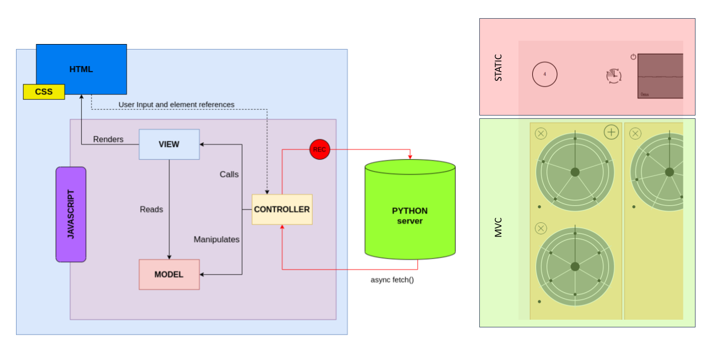
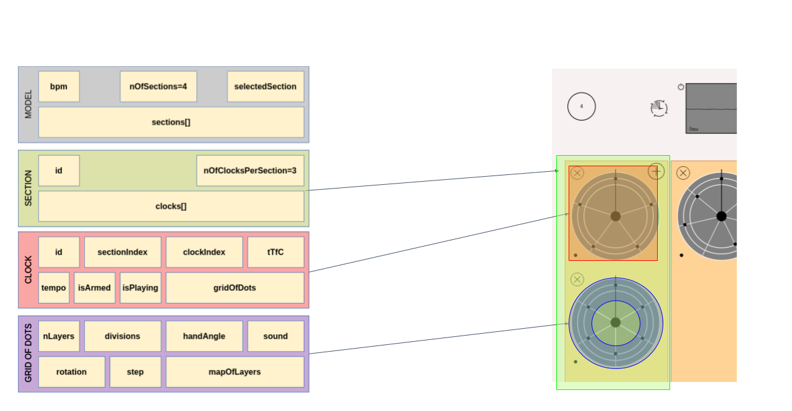

# Beatbox Machine

**The human-machine rhythm converter** [available here](https://beatbox-machine.magiwanders.com/main/index.html)

Created by:

**Enrico Zoboli & Simone Shawn Cazzaniga**  


## About The Project

Presentation link: https://drive.google.com/file/d/1AeHddVSj2ac9mk5Ok0uodCFo_lKkN1NA/view?usp=sharing

The goal of the project is to create a proof of concept to convert the rhythm produced by the human beatbox into a rhythmic visual system and a playable rhythmic clock. The aim is to support those who want quickly sketch a rhythmic idea to be used later in their projects.

### Built With

**Frontend:**

* HTML
* CSS
* Javascript

**Backend:**

* Python 3.8

## Geting Started

### Prerequisites

**1. Python 3.8**

**2. Python dependencies (the python server is meant to be run locally):**

* Numpy
* Simplejson
* Librosa
* Scipy
* Sklearn
* Tensorflow

#### Setup and Basic Usage

* Start the Python server by running in Python3 the file "start_here.py". Be sure to include all packages in the enviroment as listed in the section **Python dependencies**.

* Click the start/power button to start the AudioContext of your browser.

* Start a new recording by click the "Add button" of a section.

* Beatbox one measure of the desired rhythm with your device microphone.

* Stop the recording by clicking the "Clock Button", a new **"Rhythm Clock"** will be created automatically.

* Example of polyrhytmic creation: in order to create a 5 over 4 rhythm a clock of 4 and a clock of 5 should be created. Press the the left bottom button of the clock of 4 and play simultaneusly the two clocks.

* Note: you don't need to be precise to the global BPM in order to create the specific rhythm. 5 drum sounds sucessively will produce a clock of 5 divisions. 


#### Further Usage

#### Sections and clock creation

* Each vertical section can contain up to three clocks. The application contains 4 sections. Both this numbers will be made infinite in a future version of the application.
* To Add a new clock in a section click the "Add Button" in the top of the section.
* All the clocks inserted in a section can be armed simultaneusly by using the "Section Division" in the top left corner of the application page. The button loops the activation of the sections.
* Note that when a clock is created only the rythmic structure of the recording is conserved, not the bpm. This is intended behaviour, as it must be easy to create measures of arbitrary length and polyrhythms. 

#### Playback

* Once a clock has been created, click its center in order to arm it.
* Press the "Start Button" to listen all the armed clocks.
* Press the "Stop Button" to stop all clocks.

#### BPM

* Adjust the BPM of the Rhythm using the BPM section in the right corner.
* Every clock is synchronized to the BPM value showed in the box, unless the bottom-left "switch-bpm" toggle is activated. For more information on the effect of this button see the "Switch-bpm" section below.
* The bpm shuld be set at the beginning of the session, but it is possible to change it midway: all the clocks will be updated.

#### Switch-bpm

* When enabled, it makes the hand of the relative clock move as it were synchronous to an 8 division clock. This is the fastest way to create polythytms in the application. 
* Contrary to the global bpm, this changes only the inner tempo of its single clock, so it cannot be changed while the clock is playing! Funky behaviour will emerge if you do that. Stop the clocks, change the switch-bpm setting and re-play the clocks.
* This function currently hits the limits of the JavaScript setInterval() function in some special cases: in fact, when the computation of the new clock bpm happens, JavaScript cuts the precision of the intervals to a finite number of decimal places. In case the original value had a large number of decimal places, it gets cut, which after some revolutions makes the clock go out of sync. For this there is currently no clean solution. A patch could be added in the future based on error estimation. 

#### Remove

* Each clock can be removed from the application page using the "Cross Button" in the left corner of a clock.


## Architecture and components

The current verison of the application is based on a client-server architecture. The client is represented by the HTML/CSS/JS page, while the server by the Python backend code.


### Frontend

* The frontend of the application is built with HTML, CSS and Javascript interaction.
* The whole main page is based on a MVC (Model View Controller) framework realised specifically for the application.





* The main components of the application are:
    * Rhythmic Cloks
    * Sections
    * Controller Buttons
    * BPM Controller

#### Rhythmic Clock

A Rhythmic Clock is composed by:

* Layers
    * The layers of a clock are three (in this version) and each layer correspond to the rhythmic progression of a single sound.
    * The application can recognise up to three main drum sounds:
        * Hihat
        * Kick
        * Snare
    * This order is keep also in the layers organization starting from the most inner layer.
    * The recognition process is built in the backend system using a 1D Convolutional Neural Network created specifically for this project.

* Hand

    * The aim of the hand is to visually comunicate the angular position of the current played sound.
    * The hand moves accordingly to the divisions of the rhythm, extrapolated by the backend system.

* Dots

    * The dots built on the clock's layers are used to visualize the final rhythm presented.
    * Eack dot correspond to a drum sound to be played.


#### Section

* In this version of the application there are four simultaneous section. Each section can contain up to three clocks.
* The section has by default an "Add Button" used to start a new recording.
* All the clocks of a specific section can be armed using the "Section Controller" in the top left of the page.

#### Controller Buttons

The buttons present are mainly:
* Power Button:
    * Necessary to start the Audiocontext in the Browser.
* Play Button:
    * Start the movements of the hand and the sounds from the clocks
* Stop Button:
    * Stop and bring back to the start the hand of every clock
* Create Clock:
    * Pressed for ending the recording.
    * It'll send the recording to the Python server and add automatically a clock according to the recording.

#### BPM Controller

* The BPM controller is located in the top right corner of the page.
* It's used to modify the BPM of the application.
* Every clock is based on its current value to keep the sychronization.

### Backend

* The comunication between Javascript and Python is possible thanks to a Python server process at the address "localhost::8080".

* The data generated by the user recording is processed, returning all the necessary information to build a clock.

* All the backend processes could be seen as:
    * Microphone
    * Fetch
    * Server
    * DSP
    * Neural Network

#### Microphone
* The microphone used for capute the user input voice is based on the navigator object of Javascript. 
* As in code below the Audio Stream is created by the Audiocontext "createMediaStreamSource" function. 
* Parallel to the navigato object a script processor of Audiocontext is created. 
* The script processor will allow the Media Stream to be used in the application.
* The stream is connected to the script processor and to the canvas analyzer.

```
async function MicrophoneConnect() {
    ms = await navigator.mediaDevices.getUserMedia({ audio: true })
    mss = audioctx.createMediaStreamSource(ms);
    //Routing
    mss.connect(sp);
    mss.connect(a);
}
```

* The recording takes place by resetting an index in a for loop which will write into a Float32 Buffer.
* As code below the Recording function will take the output of the script processor as input to write the audio data in the AudioData buffer.
```
function RecordAudio(data_rec) {
    for (var i = 0; i < data_rec.length; i++) {
        if (AudioIndex < AudioData.length) {
            AudioData[AudioIndex++] = data_rec[i];
        }
    }
}
```
#### Fetch

* It takes place in the Javascript enviroment by clicking the "Create Clock" button.
* It's used to send the data generated by the application to the server process.
* This function in called in a asychronous method used for wait the server response.
* The data sent is composed to:
    * Raw data recording
    * BPM value

#### Server

* The Python3 server process is based on HTTP server.
* The main function used for the Python/JS comunication is the POST method.
* The POST is used to start the processing of the signal and reply back to the client the visualization data.

#### DSP

* Started by the server POST, is use both the BPM value and raw data recording.
* Its aim is to extrapolate the number of the divisions necessary to express the rhythm and call the neural network for the classification of a single drum sound.
* The sequence of algorithms of processing are mainly:
1. Creation of a novelty version of the recording.
2. Find firts and last peak of the function.
3. Trim the recording according to first and last peak and the BPM.
4. Novelty function of the trimmed recording.
5. APM (Autocorrelation Phase Matrix) based on the novelty.
6. Check on the K and phi found by keep the most relevant.
7. Peaks to divisions conversion.
8. Trimming the recording in order to isolate only one drum sound.
9. MFCCs extraction and neural network prediction on the isolated drum sound.
10. Creation of arrays for every drum sound (Kick, Hihat, Snare) containg the position of the sound in the rhythm.
11. Conversion from linear array to angles interpretaed by the clocks.

#### Neural Network

* A very simple neural network is used for the prediction over the sounds passed by the processing part.
* It can predict over three main diffrent sounds (in this version): Kick, Snare, Hihat.
* It's based over a state-of-the-art Tensorflow 1D Convolutional Neural Network.
* the input is based on the standard Librosa MFCCs coefficients.
* The network has been trained over real data created specifically for the project.


## Contact

* Simone Shawn Cazzaniga: simoneshawn.cazzaniga@mail.polimi.it
* Enrico Zoboli: enrico.zoboli@mail.polimi.it
